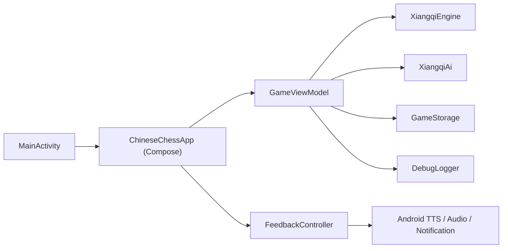
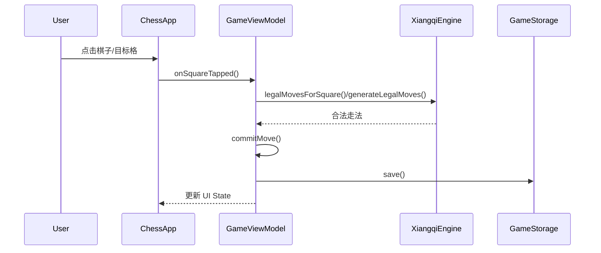
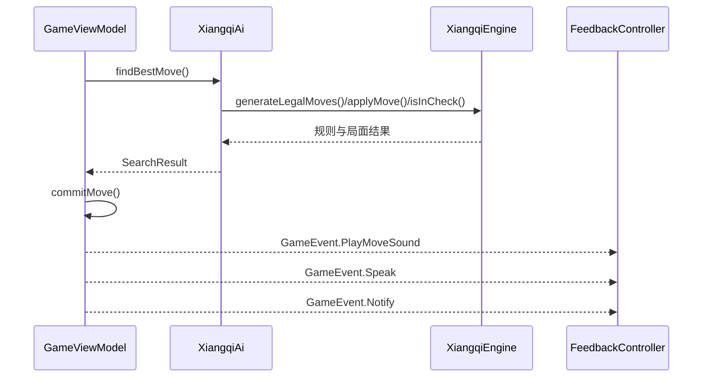
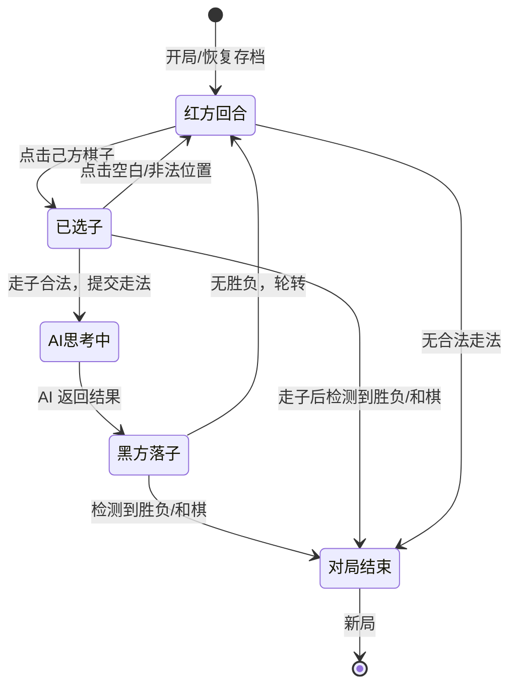

# 老爸下象棋 系统设计方案

## 1. 文档目标

本文档用于描述当前系统实现、关键技术决策和后续演进方向，支持项目在不丢失上下文的前提下持续迭代。

## 2. 设计原则

- 单机优先：不依赖后端即可完成核心体验
- 规则优先：合法走法和应将逻辑优先于 AI 花哨度
- 老人友好：UI 设计服从可读性和直觉性
- 可回归：每个规则漏洞和 AI 漏洞都应尽量转化为测试
- 可观测：关键行为需要日志，方便定位设备差异问题

## 3. 技术栈

- 语言：Kotlin
- UI：Jetpack Compose + Material 3
- 平台：Android SDK 35，最低 Android 29
- 构建：Gradle Kotlin DSL
- 测试：JUnit4
- 发布：GitHub Actions + GitHub Releases

## 4. 系统边界

系统当前为单 Activity、纯本地运行的 Android 应用，不依赖远程服务。

### 4.1 外部依赖

- Android Framework
- Android TextToSpeech
- NotificationCompat
- GitHub Actions 作为 CI/CD 平台

### 4.2 不在系统内的部分

- 联网对战服务
- 云端用户数据
- 云端棋谱库 / 残局库

## 5. 整体架构

## 6. 模块划分

### 6.1 启动与宿主层

- 文件：[MainActivity.kt](../app/src/main/java/com/decli/chinesechess/MainActivity.kt)
- 职责：
  - 全屏和横屏配置
  - 挂载 Compose 根视图

### 6.2 UI 层

- 文件：[ChessApp.kt](../app/src/main/java/com/decli/chinesechess/ui/ChessApp.kt)
- 职责：
  - 棋盘绘制
  - 控制面板与交互入口
  - 收集 `GameViewModel` 状态并渲染
  - 消费 `GameEvent`，转发给语音、音效、通知和日志导出链路

### 6.3 对局状态层

- 文件：[GameViewModel.kt](../app/src/main/java/com/decli/chinesechess/game/GameViewModel.kt)
- 职责：
  - 管理对局状态
  - 处理用户操作：选子、走子、悔棋、提示、新局
  - 调用 AI
  - 生成界面提示和语音播报文案
  - 触发存档和恢复

### 6.4 规则引擎层

- 文件：[XiangqiEngine.kt](../app/src/main/java/com/decli/chinesechess/game/XiangqiEngine.kt)
- 职责：
  - 生成伪合法走法
  - 生成合法走法
  - 将军检测
  - 胜负判定
  - 核心棋规校验

### 6.5 AI 搜索层

- 文件：[XiangqiAi.kt](../app/src/main/java/com/decli/chinesechess/game/XiangqiAi.kt)
- 职责：
  - 局面评估
  - 迭代加深搜索
  - Alpha-Beta / PVS / Aspiration Window / Killer Move / History Heuristic / LMR
  - 优势转换模式
  - 重复局面惩罚与残局收官倾向

### 6.6 数据与模型层

- 文件：[XiangqiModel.kt](../app/src/main/java/com/decli/chinesechess/game/XiangqiModel.kt)
- 职责：
  - 棋盘、走法、局面、阵营、难度等基础模型定义

### 6.7 持久化层

- 文件：[GameStorage.kt](../app/src/main/java/com/decli/chinesechess/game/GameStorage.kt)
- 职责：
  - 对局序列化 / 反序列化
  - 保存难度与音频开关

### 6.8 反馈与可观测性

- 文件：[FeedbackController.kt](../app/src/main/java/com/decli/chinesechess/ui/FeedbackController.kt)、[DebugLogger.kt](../app/src/main/java/com/decli/chinesechess/debug/DebugLogger.kt)
- 职责：
  - 落子音效
  - AI 语音播报
  - 通知
  - 调试日志记录与导出

## 7. 关键数据模型

### 7.1 棋盘表示

- 使用长度为 90 的 `IntArray`
- 每个格子对应一个整数，正负表示红黑，绝对值表示棋子类型
- 优点：
  - 内存占用低
  - 复制与搜索简单
  - 适合移动端本地搜索

### 7.2 棋子编码

| 绝对值 | 棋子类型 | 红方显示 | 黑方显示 | 基础估值 |
|--------|---------|---------|---------|---------|
| 1 | 将/帅 (GENERAL) | 帅 | 将 | 12000 |
| 2 | 士/仕 (ADVISOR) | 仕 | 士 | 140 |
| 3 | 象/相 (ELEPHANT) | 相 | 象 | 150 |
| 4 | 马 (HORSE) | 马 | 马 | 340 |
| 5 | 车 (ROOK) | 车 | 车 | 720 |
| 6 | 炮 (CANNON) | 炮 | 炮 | 380 |
| 7 | 兵/卒 (PAWN) | 兵 | 卒 | 110 |

正值为红方，负值为黑方，0 为空格。

### 7.3 核心对象

- `Move`：起点 (`from`)、终点 (`to`)、移动棋子 (`movedPiece`)、吃子信息 (`capturedPiece`)
- `Position`：棋盘 (`board`)、轮到谁走 (`sideToMove`)、总半步数 (`plyCount`)、连续无吃子半步数 (`quietHalfMoves`)、最后一步 (`lastMove`)
- `SearchResult`：最佳着法 (`move`)、评分 (`score`)、搜索深度 (`depthReached`)、搜索节点数 (`nodes`)
- `SavedGame`：落子序列 (`moves`)、难度 (`difficulty`)、音效开关 (`soundEnabled`)、语音开关 (`ttsEnabled`)、通知开关 (`notificationsEnabled`)

### 7.4 难度参数

| 难度 | 显示名 | 最大深度 | 时间上限 | 节点上限 |
|------|--------|---------|---------|---------|
| EASY | 入门 | 2 | 350ms | 20,000 |
| MEDIUM | 中级 | 4 | 900ms | 120,000 |
| HARD | 高手 | 6 | 1,800ms | 420,000 |

各难度同时受深度、时间和节点三重限制，任一条件先到即停。

## 8. 核心流程

### 8.1 用户落子流程

### 8.2 AI 落子流程

### 8.3 存档恢复流程

- 启动时：
  - `GameViewModel` 调用 `GameStorage.load()`
  - 根据保存的走法序列回放出当前局面
- 每次提交走法时：
  - `persistGame()` 将当前走法序列和设置写入 `SharedPreferences`

## 9. 线程与并发模型

- UI 层运行在主线程，由 Jetpack Compose 驱动
- AI 搜索通过 `viewModelScope.launch(Dispatchers.Default)` 在后台线程执行
- AI 思考期间 `GameUiState.aiThinking = true`，UI 禁止用户操作并显示"正在思考"
- AI 协程通过 `Job` 引用管理，悔棋/新局时可取消当前搜索
- 状态通过 `StateFlow<GameUiState>` 从 ViewModel 推送到 Compose UI
- 一次性事件（音效、语音、通知）通过 `SharedFlow<GameEvent>` 传递

## 10. 游戏状态机

核心状态由 `GameUiState` 的字段组合表达：
- `winner == null && !aiThinking && sideToMove == RED` → 红方回合
- `selectedSquare != null` → 已选子
- `aiThinking == true` → AI 思考中
- `winner != null` → 对局结束

## 11. 错误处理设计

- **存档加载失败**：`GameStorage.load()` 返回 `null`，ViewModel 回退到新局，不抛异常
- **存档格式损坏**：走法回放过程中若出现非法走法，应捕获异常并回退到新局
- **AI 无合法走法**：`findBestMove()` 返回 `move = null`，ViewModel 调用 `resolveWinner()` 判定胜负
- **TTS 初始化/播报失败**：`FeedbackController` 捕获异常，降级到内置语音片段，不影响主线程
- **通知权限缺失**：静默跳过通知发送，不崩溃
- **原则**：任何非核心功能（语音、通知、日志导出）的异常都不得向上传播导致崩溃

## 12. AI 设计

### 12.1 当前搜索框架

- 迭代加深
- Negamax / Alpha-Beta
- PVS
- Aspiration Window
- Killer Move
- History Heuristic
- LMR
- 检查 / 重复局面处理

### 12.2 当前 AI 设计目标

- 在移动端可控时延下获得可接受棋力
- 通过时间和节点限制避免卡死
- 在明显优势局中具备收官倾向
- 通过重复着法惩罚减少低质量和棋

### 12.3 已实现的增强方向

- 优势转换模式：在明显大优和残局局面中增强进攻性排序与评估
- 单帅残局专项求杀快搜
- 长将 / 长捉倾向惩罚
- 局面历史纳入搜索上下文

### 12.4 后续建议

- 规则裁决进一步拆分长将 / 长捉 / 闲着循环
- 引入更系统的残局专项搜索
- 为典型残局建立固定回归样例
- 为 AI 搜索建立性能基线测试

## 13. 音频与语音设计

### 13.1 当前实现

- 落子音效：本地合成 PCM 音频
- 语音播报：系统 TTS 优先，失败时回退到内置语音片段
- 通知：文本通知，不依赖系统自动朗读

### 13.2 设计考量

- 必须保证“有反馈”，因此允许 TTS 失败时降级
- 但降级到音频片段会损失自然度

### 13.3 已知问题

- Android 各 ROM 的 TTS 可用性差异较大
- 系统 TTS 是否真正可用，需要更强的运行时观测
- 片段拼接语音天然不如系统神经 TTS 拟人

### 13.4 建议演进方向

- 增加 TTS 成功 / 失败的可观测性
- 区分“系统 TTS 可用但播报失败”与“系统 TTS 不可用”
- 优先走系统原生语音，不轻易改动其默认语速 / 音高

## 14. 规则正确性设计

- 合法走法由规则引擎统一生成
- 所有“应将”判断基于 `isInCheck()` 和 `isSquareAttacked()`
- 规则漏洞优先转化为回归测试

当前已建立的规则回归包括：

- 马将军时必须应将
- 车将军时必须应将
- 炮将军时必须应将
- 兵将军时必须应将
- 对脸将时必须应将

## 15. 测试策略

### 15.1 单元测试

- 规则正确性
- 起始局面合法走法数量
- AI 至少返回合法着法
- 典型残局收官行为

### 15.2 手工回归

- 14 寸横屏布局
- 自动保存和恢复
- 音效 / 语音 / 通知链路
- Release APK 安装运行

### 15.3 CI 质量门槛

- `testDebugUnitTest`
- `assembleRelease`
- 成功后发布 APK 到 GitHub Release

## 16. 发布架构

- CI 配置位于 `.github/workflows/android-apk.yml`
- 每次主分支成功构建后：
  - 产出 release APK
  - 上传 artifact
  - 发布到 GitHub Releases

## 17. 目录约定

- `app/src/main/java/.../game`：规则、AI、模型、状态
- `app/src/main/java/.../ui`：Compose UI、音频、通知
- `app/src/main/java/.../debug`：调试日志
- `app/src/test/java/...`：单元测试
- `docs/`：PRD、系统设计和后续设计文档

## 18. 后续迭代建议

- 任何需求先更新 PRD
- 任何系统性改动先更新系统设计
- 规则修复必须补测试
- AI 优化必须同时看棋力、时延、死循环风险
- 语音改造必须先明确“主链路”和“降级链路”
