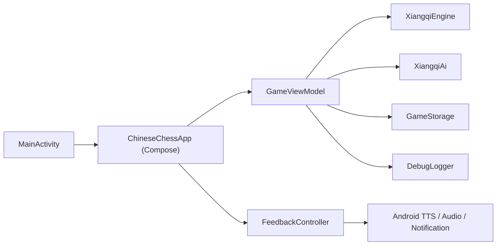
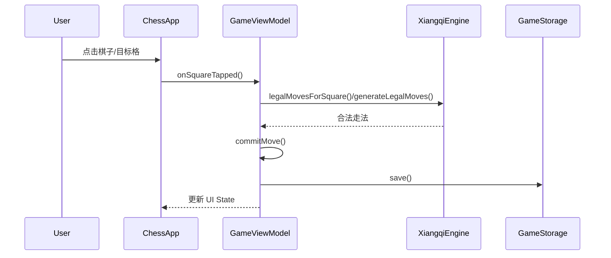
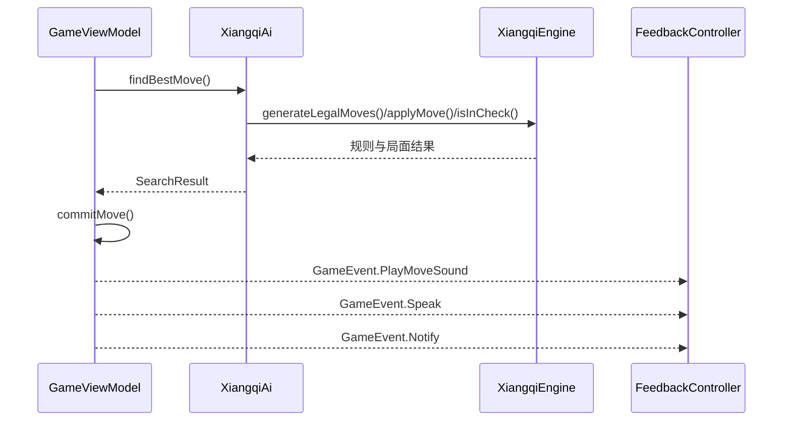

# 老爸下象棋 系统设计方案

## 1. 文档目标

本文档用于描述当前系统实现、关键技术决策和后续演进方向，支持项目在不丢失上下文的前提下持续迭代。

## 2. 设计原则

- 单机优先：不依赖后端即可完成核心体验
- 规则优先：合法走法和应将逻辑优先于 AI 花哨度
- 老人友好：UI 设计服从可读性和直觉性
- 可回归：每个规则漏洞和 AI 漏洞都应尽量转化为测试
- 可观测：关键行为需要日志，方便定位设备差异问题

## 3. 技术栈

- 语言：Kotlin
- UI：Jetpack Compose + Material 3
- 平台：Android SDK 35，最低 Android 29
- 构建：Gradle Kotlin DSL
- 测试：JUnit4
- 发布：GitHub Actions + GitHub Releases

## 4. 系统边界

系统当前为单 Activity、纯本地运行的 Android 应用，不依赖远程服务。

### 4.1 外部依赖

- Android Framework
- Android TextToSpeech
- NotificationCompat
- GitHub Actions 作为 CI/CD 平台

### 4.2 不在系统内的部分

- 联网对战服务
- 云端用户数据
- 云端棋谱库 / 残局库

## 5. 整体架构

## 6. 模块划分

### 6.1 启动与宿主层

- 文件：[MainActivity.kt](D:\code\codex\chinesechess03\app\src\main\java\com\decli\chinesechess\MainActivity.kt)
- 职责：
  - 全屏和横屏配置
  - 挂载 Compose 根视图

### 6.2 UI 层

- 文件：[ChessApp.kt](D:\code\codex\chinesechess03\app\src\main\java\com\decli\chinesechess\ui\ChessApp.kt)
- 职责：
  - 棋盘绘制
  - 控制面板与交互入口
  - 收集 `GameViewModel` 状态并渲染
  - 消费 `GameEvent`，转发给语音、音效、通知和日志导出链路

### 6.3 对局状态层

- 文件：[GameViewModel.kt](D:\code\codex\chinesechess03\app\src\main\java\com\decli\chinesechess\game\GameViewModel.kt)
- 职责：
  - 管理对局状态
  - 处理用户操作：选子、走子、悔棋、提示、新局
  - 调用 AI
  - 生成界面提示和语音播报文案
  - 触发存档和恢复

### 6.4 规则引擎层

- 文件：[XiangqiEngine.kt](D:\code\codex\chinesechess03\app\src\main\java\com\decli\chinesechess\game\XiangqiEngine.kt)
- 职责：
  - 生成伪合法走法
  - 生成合法走法
  - 将军检测
  - 胜负判定
  - 核心棋规校验

### 6.5 AI 搜索层

- 文件：[XiangqiAi.kt](D:\code\codex\chinesechess03\app\src\main\java\com\decli\chinesechess\game\XiangqiAi.kt)
- 职责：
  - 局面评估
  - 迭代加深搜索
  - Alpha-Beta / PVS / Aspiration Window / Killer Move / History Heuristic / LMR
  - 优势转换模式
  - 重复局面惩罚与残局收官倾向

### 6.6 数据与模型层

- 文件：[XiangqiModel.kt](D:\code\codex\chinesechess03\app\src\main\java\com\decli\chinesechess\game\XiangqiModel.kt)
- 职责：
  - 棋盘、走法、局面、阵营、难度等基础模型定义

### 6.7 持久化层

- 文件：[GameStorage.kt](D:\code\codex\chinesechess03\app\src\main\java\com\decli\chinesechess\game\GameStorage.kt)
- 职责：
  - 对局序列化 / 反序列化
  - 保存难度与音频开关

### 6.8 反馈与可观测性

- 文件：[FeedbackController.kt](D:\code\codex\chinesechess03\app\src\main\java\com\decli\chinesechess\ui\FeedbackController.kt)、[DebugLogger.kt](D:\code\codex\chinesechess03\app\src\main\java\com\decli\chinesechess\debug\DebugLogger.kt)
- 职责：
  - 落子音效
  - AI 语音播报
  - 通知
  - 调试日志记录与导出

## 7. 关键数据模型

### 7.1 棋盘表示

- 使用长度为 90 的 `IntArray`
- 每个格子对应一个整数，正负表示红黑，绝对值表示棋子类型
- 优点：
  - 内存占用低
  - 复制与搜索简单
  - 适合移动端本地搜索

### 7.2 核心对象

- `Move`：起点、终点、移动棋子、吃子信息
- `Position`：棋盘、轮到谁走、半回合计数、最后一步
- `SearchResult`：最佳着法、评分、搜索深度、节点数
- `SavedGame`：落子序列和用户设置

## 8. 核心流程

### 8.1 用户落子流程

### 8.2 AI 落子流程

### 8.3 存档恢复流程

- 启动时：
  - `GameViewModel` 调用 `GameStorage.load()`
  - 根据保存的走法序列回放出当前局面
- 每次提交走法时：
  - `persistGame()` 将当前走法序列和设置写入 `SharedPreferences`

## 9. AI 设计

### 9.1 当前搜索框架

- 迭代加深
- Negamax / Alpha-Beta
- PVS
- Aspiration Window
- Killer Move
- History Heuristic
- LMR
- 检查 / 重复局面处理

### 9.2 当前 AI 设计目标

- 在移动端可控时延下获得可接受棋力
- 通过时间和节点限制避免卡死
- 在明显优势局中具备收官倾向
- 通过重复着法惩罚减少低质量和棋

### 9.3 已实现的增强方向

- 优势转换模式：在明显大优和残局局面中增强进攻性排序与评估
- 单帅残局专项求杀快搜
- 长将 / 长捉倾向惩罚
- 局面历史纳入搜索上下文

### 9.4 后续建议

- 规则裁决进一步拆分长将 / 长捉 / 闲着循环
- 引入更系统的残局专项搜索
- 为典型残局建立固定回归样例
- 为 AI 搜索建立性能基线测试

## 10. 音频与语音设计

### 10.1 当前实现

- 落子音效：本地合成 PCM 音频
- 语音播报：系统 TTS 优先，失败时回退到内置语音片段
- 通知：文本通知，不依赖系统自动朗读

### 10.2 设计考量

- 必须保证“有反馈”，因此允许 TTS 失败时降级
- 但降级到音频片段会损失自然度

### 10.3 已知问题

- Android 各 ROM 的 TTS 可用性差异较大
- 系统 TTS 是否真正可用，需要更强的运行时观测
- 片段拼接语音天然不如系统神经 TTS 拟人

### 10.4 建议演进方向

- 增加 TTS 成功 / 失败的可观测性
- 区分“系统 TTS 可用但播报失败”与“系统 TTS 不可用”
- 优先走系统原生语音，不轻易改动其默认语速 / 音高

## 11. 规则正确性设计

- 合法走法由规则引擎统一生成
- 所有“应将”判断基于 `isInCheck()` 和 `isSquareAttacked()`
- 规则漏洞优先转化为回归测试

当前已建立的规则回归包括：

- 马将军时必须应将
- 车将军时必须应将
- 炮将军时必须应将
- 兵将军时必须应将
- 对脸将时必须应将

## 12. 测试策略

### 12.1 单元测试

- 规则正确性
- 起始局面合法走法数量
- AI 至少返回合法着法
- 典型残局收官行为

### 12.2 手工回归

- 14 寸横屏布局
- 自动保存和恢复
- 音效 / 语音 / 通知链路
- Release APK 安装运行

### 12.3 CI 质量门槛

- `testDebugUnitTest`
- `assembleRelease`
- 成功后发布 APK 到 GitHub Release

## 13. 发布架构

- CI 配置位于 `.github/workflows/android-apk.yml`
- 每次主分支成功构建后：
  - 产出 release APK
  - 上传 artifact
  - 发布到 GitHub Releases

## 14. 目录约定

- `app/src/main/java/.../game`：规则、AI、模型、状态
- `app/src/main/java/.../ui`：Compose UI、音频、通知
- `app/src/main/java/.../debug`：调试日志
- `app/src/test/java/...`：单元测试
- `docs/`：PRD、系统设计和后续设计文档

## 15. 后续迭代建议

- 任何需求先更新 PRD
- 任何系统性改动先更新系统设计
- 规则修复必须补测试
- AI 优化必须同时看棋力、时延、死循环风险
- 语音改造必须先明确“主链路”和“降级链路”
